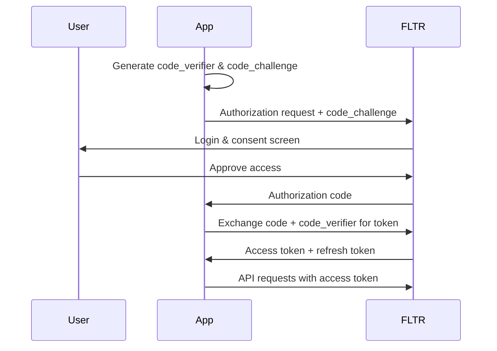

# OAuth 2.1 Authentication

FLTR uses OAuth 2.1 with PKCE (Proof Key for Code Exchange) to provide secure authentication for MCP clients like Claude Desktop, VS Code, Cursor, and web applications.

## Overview

OAuth 2.1 provides:
- **15,000 requests/hour** rate limit (15x more than API keys)
- **Scope-based permissions** for fine-grained access control
- **PKCE security** to prevent authorization code interception
- **Automatic token refresh** for seamless user experience
- **Native MCP support** for AI development tools

## Quick Start for MCP Clients

<Steps>
  <Step title="Configure Claude Desktop">
    Add FLTR to your Claude Desktop MCP configuration:

    ```json
    {
      "mcpServers": {
        "fltr": {
          "command": "npx",
          "args": ["-y", "@fltr/mcp-server"],
          "env": {
            "FLTR_OAUTH_CLIENT_ID": "your_client_id",
            "FLTR_AUTH_URL": "https://www.tryfltr.com/oauth/authorize"
          }
        }
      }
    }
    ```
  </Step>

  <Step title="Authorize Access">
    1. Restart Claude Desktop
    2. Click "Connect to FLTR" when prompted
    3. Log in and authorize the requested scopes
    4. Return to Claude Desktop - you're connected!
  </Step>

  <Step title="Start Using FLTR">
    Query your datasets directly from Claude:

    ```
    Search my "Product Docs" dataset for information about authentication
    ```
  </Step>
</Steps>

## OAuth Flow

FLTR implements the Authorization Code flow with PKCE:



## Implementation Guide

### 1. Register Your Application

1. Log in to [www.tryfltr.com](https://www.tryfltr.com)
2. Navigate to **Settings** → **OAuth Applications**
3. Click **Create OAuth App**
4. Fill in the details:
   - **Name**: Your application name
   - **Redirect URI**: Where users return after authorization
   - **Scopes**: Permissions your app needs

5. Save your **Client ID** and **Client Secret**

<Warning>
Store your Client Secret securely. Never commit it to version control or expose it in client-side code.
</Warning>

### 2. Generate PKCE Parameters

Before starting the OAuth flow, generate PKCE parameters:

<CodeGroup>

```python Python
import secrets
import hashlib
import base64

# Generate code_verifier
code_verifier = base64.urlsafe_b64encode(secrets.token_bytes(32)).decode('utf-8')
code_verifier = code_verifier.rstrip('=')

# Generate code_challenge
code_challenge = hashlib.sha256(code_verifier.encode('utf-8')).digest()
code_challenge = base64.urlsafe_b64encode(code_challenge).decode('utf-8')
code_challenge = code_challenge.rstrip('=')

print(f"code_verifier: {code_verifier}")
print(f"code_challenge: {code_challenge}")
```

```javascript JavaScript
import crypto from 'crypto';

// Generate code_verifier
function generateCodeVerifier() {
  return base64URLEncode(crypto.randomBytes(32));
}

// Generate code_challenge from verifier
function generateCodeChallenge(verifier) {
  return base64URLEncode(
    crypto.createHash('sha256').update(verifier).digest()
  );
}

function base64URLEncode(buffer) {
  return buffer
    .toString('base64')
    .replace(/\+/g, '-')
    .replace(/\//g, '_')
    .replace(/=/g, '');
}

const codeVerifier = generateCodeVerifier();
const codeChallenge = generateCodeChallenge(codeVerifier);

console.log('code_verifier:', codeVerifier);
console.log('code_challenge:', codeChallenge);
```

</CodeGroup>

### 3. Authorization Request

Redirect the user to FLTR's authorization endpoint:

```
https://www.tryfltr.com/oauth/authorize?
  response_type=code&
  client_id=YOUR_CLIENT_ID&
  redirect_uri=YOUR_REDIRECT_URI&
  scope=datasets:read datasets:write mcp:query&
  state=RANDOM_STATE&
  code_challenge=CODE_CHALLENGE&
  code_challenge_method=S256
```

**Parameters:**

| Parameter | Required | Description |
|-----------|----------|-------------|
| `response_type` | Yes | Must be `code` |
| `client_id` | Yes | Your OAuth client ID |
| `redirect_uri` | Yes | Where to redirect after authorization |
| `scope` | Yes | Space-separated list of scopes |
| `state` | Recommended | Random string to prevent CSRF |
| `code_challenge` | Yes | SHA256 hash of code_verifier |
| `code_challenge_method` | Yes | Must be `S256` |

**Available Scopes:**

```
datasets:read       Read datasets and documents
datasets:write      Create and modify datasets
datasets:delete     Delete datasets and documents
mcp:query          Use MCP query endpoints
mcp:batch_query    Use batch query endpoints
webhooks:manage     Create and manage webhooks
account:read        Read account information
```

<CodeGroup>

```python Python
from urllib.parse import urlencode

params = {
    'response_type': 'code',
    'client_id': 'YOUR_CLIENT_ID',
    'redirect_uri': 'https://yourapp.com/callback',
    'scope': 'datasets:read datasets:write mcp:query',
    'state': secrets.token_urlsafe(32),
    'code_challenge': code_challenge,
    'code_challenge_method': 'S256'
}

auth_url = f"https://www.tryfltr.com/oauth/authorize?{urlencode(params)}"
print(f"Redirect user to: {auth_url}")
```

```javascript JavaScript
const params = new URLSearchParams({
  response_type: 'code',
  client_id: 'YOUR_CLIENT_ID',
  redirect_uri: 'https://yourapp.com/callback',
  scope: 'datasets:read datasets:write mcp:query',
  state: crypto.randomBytes(32).toString('hex'),
  code_challenge: codeChallenge,
  code_challenge_method: 'S256'
});

const authUrl = `https://www.tryfltr.com/oauth/authorize?${params}`;
console.log('Redirect user to:', authUrl);
```

</CodeGroup>

### 4. Handle Callback

After the user authorizes, FLTR redirects back to your `redirect_uri` with an authorization code:

```
https://yourapp.com/callback?
  code=AUTH_CODE&
  state=RANDOM_STATE
```

**Verify the state parameter** matches what you sent to prevent CSRF attacks.

### 5. Exchange Code for Token

Exchange the authorization code for an access token:

```bash
POST https://www.tryfltr.com/oauth/token
Content-Type: application/x-www-form-urlencoded

grant_type=authorization_code&
code=AUTH_CODE&
client_id=YOUR_CLIENT_ID&
client_secret=YOUR_CLIENT_SECRET&
redirect_uri=YOUR_REDIRECT_URI&
code_verifier=CODE_VERIFIER
```

<CodeGroup>

```python Python
import requests

token_response = requests.post(
    'https://www.tryfltr.com/oauth/token',
    data={
        'grant_type': 'authorization_code',
        'code': auth_code,
        'client_id': 'YOUR_CLIENT_ID',
        'client_secret': 'YOUR_CLIENT_SECRET',
        'redirect_uri': 'https://yourapp.com/callback',
        'code_verifier': code_verifier
    }
)

tokens = token_response.json()
access_token = tokens['access_token']
refresh_token = tokens['refresh_token']
expires_in = tokens['expires_in']  # Seconds until expiration
```

```javascript JavaScript
const response = await fetch('https://www.tryfltr.com/oauth/token', {
  method: 'POST',
  headers: {
    'Content-Type': 'application/x-www-form-urlencoded'
  },
  body: new URLSearchParams({
    grant_type: 'authorization_code',
    code: authCode,
    client_id: 'YOUR_CLIENT_ID',
    client_secret: 'YOUR_CLIENT_SECRET',
    redirect_uri: 'https://yourapp.com/callback',
    code_verifier: codeVerifier
  })
});

const tokens = await response.json();
const accessToken = tokens.access_token;
const refreshToken = tokens.refresh_token;
const expiresIn = tokens.expires_in;
```

</CodeGroup>

**Response:**

```json
{
  "access_token": "fltr_at_abc123...",
  "refresh_token": "fltr_rt_def456...",
  "token_type": "Bearer",
  "expires_in": 3600,
  "scope": "datasets:read datasets:write mcp:query"
}
```

### 6. Make API Requests

Use the access token to make authenticated API requests:

```python
headers = {
    'Authorization': f'Bearer {access_token}',
    'Content-Type': 'application/json'
}

response = requests.get(
    'https://api.fltr.com/v1/datasets',
    headers=headers
)
```

### 7. Refresh Tokens

Access tokens expire after 1 hour. Use the refresh token to get a new access token:

```bash
POST https://www.tryfltr.com/oauth/token
Content-Type: application/x-www-form-urlencoded

grant_type=refresh_token&
refresh_token=REFRESH_TOKEN&
client_id=YOUR_CLIENT_ID&
client_secret=YOUR_CLIENT_SECRET
```

<CodeGroup>

```python Python
def refresh_access_token(refresh_token):
    response = requests.post(
        'https://www.tryfltr.com/oauth/token',
        data={
            'grant_type': 'refresh_token',
            'refresh_token': refresh_token,
            'client_id': 'YOUR_CLIENT_ID',
            'client_secret': 'YOUR_CLIENT_SECRET'
        }
    )

    tokens = response.json()
    return tokens['access_token'], tokens['refresh_token']

# Automatically refresh when token expires
if time.time() >= token_expires_at:
    access_token, refresh_token = refresh_access_token(refresh_token)
    token_expires_at = time.time() + 3600
```

```javascript JavaScript
async function refreshAccessToken(refreshToken) {
  const response = await fetch('https://www.tryfltr.com/oauth/token', {
    method: 'POST',
    headers: {
      'Content-Type': 'application/x-www-form-urlencoded'
    },
    body: new URLSearchParams({
      grant_type: 'refresh_token',
      refresh_token: refreshToken,
      client_id: 'YOUR_CLIENT_ID',
      client_secret: 'YOUR_CLIENT_SECRET'
    })
  });

  const tokens = await response.json();
  return {
    accessToken: tokens.access_token,
    refreshToken: tokens.refresh_token
  };
}

// Automatically refresh when token expires
if (Date.now() >= tokenExpiresAt) {
  const { accessToken, refreshToken } = await refreshAccessToken(refreshToken);
  tokenExpiresAt = Date.now() + 3600 * 1000;
}
```

</CodeGroup>

## MCP Server Configuration

For MCP clients (Claude Desktop, VS Code, Cursor), use the FLTR MCP server:

### Claude Desktop

`~/Library/Application Support/Claude/claude_desktop_config.json` (macOS)
`%APPDATA%\Claude\claude_desktop_config.json` (Windows)

```json
{
  "mcpServers": {
    "fltr": {
      "command": "npx",
      "args": ["-y", "@fltr/mcp-server"],
      "env": {
        "FLTR_OAUTH_CLIENT_ID": "your_client_id",
        "FLTR_AUTH_URL": "https://www.tryfltr.com/oauth/authorize"
      }
    }
  }
}
```

### VS Code / Cursor

`.vscode/settings.json` or Cursor settings:

```json
{
  "mcp.servers": {
    "fltr": {
      "command": "npx",
      "args": ["-y", "@fltr/mcp-server"],
      "env": {
        "FLTR_OAUTH_CLIENT_ID": "your_client_id",
        "FLTR_AUTH_URL": "https://www.tryfltr.com/oauth/authorize"
      }
    }
  }
}
```

## Security Best Practices

### PKCE

Always use PKCE (code_challenge + code_verifier):

✅ **Do:**
- Generate a cryptographically random code_verifier (43-128 characters)
- Use SHA256 for code_challenge_method
- Store code_verifier securely until token exchange

❌ **Don't:**
- Skip PKCE (it's required)
- Reuse code_verifier across sessions
- Use MD5 or other weak hashing

### State Parameter

Use the state parameter to prevent CSRF:

```python
# Generate state
state = secrets.token_urlsafe(32)
session['oauth_state'] = state

# Verify state in callback
if request.args.get('state') != session.get('oauth_state'):
    raise SecurityError("Invalid state parameter")
```

### Token Storage

**Server-side applications:**
- Store tokens in encrypted database
- Use HTTP-only cookies for refresh tokens
- Never expose tokens to client-side JavaScript

**Client-side applications:**
- Use secure storage (Keychain on macOS, Credential Manager on Windows)
- Never store tokens in localStorage
- Consider using httpOnly cookies with a token proxy

### Redirect URI Validation

- Register exact redirect URIs (no wildcards)
- Use HTTPS in production (required)
- Validate redirect_uri in both authorization and token requests

## Error Handling

### Authorization Errors

```json
{
  "error": "invalid_scope",
  "error_description": "The requested scope is invalid or unknown"
}
```

Common errors:
- `access_denied` - User denied authorization
- `invalid_scope` - Unknown or unauthorized scope
- `invalid_request` - Missing required parameters
- `server_error` - Temporary server issue

### Token Errors

```json
{
  "error": "invalid_grant",
  "error_description": "The provided authorization code is invalid or expired"
}
```

Common errors:
- `invalid_grant` - Expired or invalid authorization code
- `invalid_client` - Invalid client credentials
- `unauthorized_client` - Client not authorized for this grant type

Handle token refresh failures:

```python
try:
    access_token, refresh_token = refresh_access_token(refresh_token)
except Exception as e:
    # Refresh failed - re-authenticate user
    redirect_to_authorization()
```

## Complete Example

Here's a complete Flask application with OAuth:

```python
from flask import Flask, redirect, request, session, url_for
import requests
import secrets
import hashlib
import base64

app = Flask(__name__)
app.secret_key = 'your-secret-key'

CLIENT_ID = 'your_client_id'
CLIENT_SECRET = 'your_client_secret'
REDIRECT_URI = 'http://localhost:5000/callback'
AUTH_URL = 'https://www.tryfltr.com/oauth/authorize'
TOKEN_URL = 'https://www.tryfltr.com/oauth/token'

@app.route('/')
def index():
    if 'access_token' in session:
        return 'Logged in! <a href="/datasets">View datasets</a>'
    return '<a href="/login">Login with FLTR</a>'

@app.route('/login')
def login():
    # Generate PKCE parameters
    code_verifier = base64.urlsafe_b64encode(secrets.token_bytes(32)).decode('utf-8').rstrip('=')
    code_challenge = base64.urlsafe_b64encode(
        hashlib.sha256(code_verifier.encode('utf-8')).digest()
    ).decode('utf-8').rstrip('=')

    # Store for later use
    session['code_verifier'] = code_verifier
    session['oauth_state'] = secrets.token_urlsafe(32)

    # Build authorization URL
    params = {
        'response_type': 'code',
        'client_id': CLIENT_ID,
        'redirect_uri': REDIRECT_URI,
        'scope': 'datasets:read mcp:query',
        'state': session['oauth_state'],
        'code_challenge': code_challenge,
        'code_challenge_method': 'S256'
    }

    from urllib.parse import urlencode
    auth_url = f"{AUTH_URL}?{urlencode(params)}"
    return redirect(auth_url)

@app.route('/callback')
def callback():
    # Verify state
    if request.args.get('state') != session.get('oauth_state'):
        return 'Invalid state', 400

    # Exchange code for token
    code = request.args.get('code')
    code_verifier = session.get('code_verifier')

    token_response = requests.post(TOKEN_URL, data={
        'grant_type': 'authorization_code',
        'code': code,
        'client_id': CLIENT_ID,
        'client_secret': CLIENT_SECRET,
        'redirect_uri': REDIRECT_URI,
        'code_verifier': code_verifier
    })

    tokens = token_response.json()
    session['access_token'] = tokens['access_token']
    session['refresh_token'] = tokens['refresh_token']

    return redirect(url_for('index'))

@app.route('/datasets')
def datasets():
    headers = {
        'Authorization': f"Bearer {session['access_token']}"
    }

    response = requests.get('https://api.fltr.com/v1/datasets', headers=headers)
    return response.json()

if __name__ == '__main__':
    app.run(debug=True)
```

## Next Steps

<CardGroup cols={2}>
  <Card title="MCP Query Endpoint" icon="magnifying-glass" href="/api-reference/mcp/query">
    Use OAuth tokens to query datasets
  </Card>

  <Card title="Scopes Reference" icon="shield" href="/authentication/scopes">
    Understand OAuth scope permissions
  </Card>

  <Card title="Rate Limits" icon="gauge" href="/support/rate-limits">
    OAuth rate limit details
  </Card>

  <Card title="Security Guide" icon="lock" href="/support/security">
    OAuth security best practices
  </Card>
</CardGroup>
